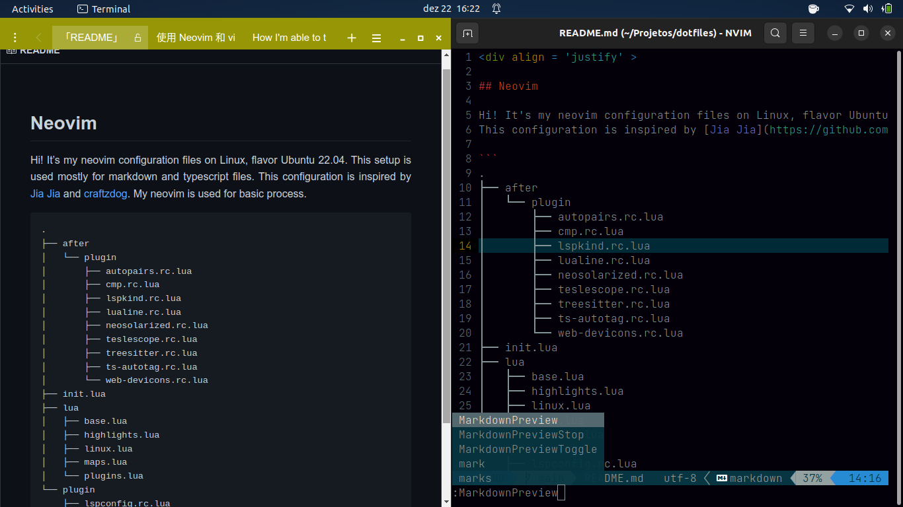
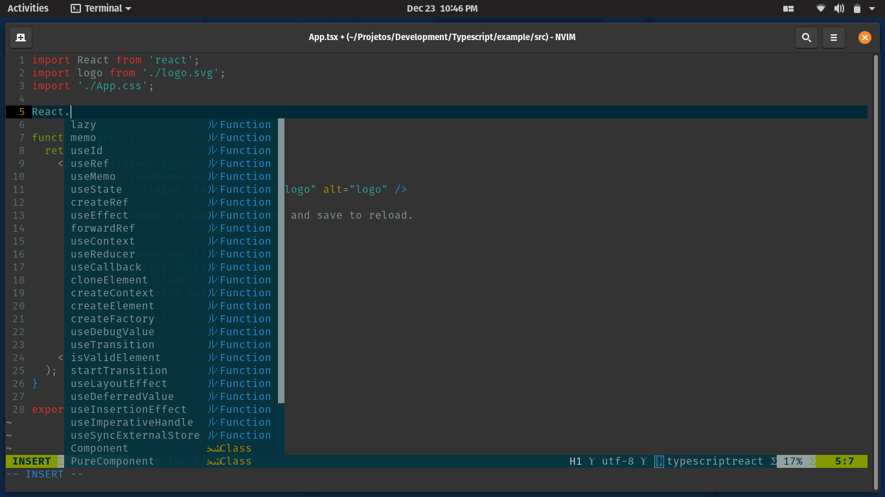

<div align = 'justify' >

# Setup - Neovim

Hi! It's my neovim configuration files on POP.OS 20.04. This setup is used mostly for markdown, typescript and small size files.
This configuration is inspired by [Jia Jia](https://github.com/mathjiajia/config.nvim) and [craftzdog](https://github.com/craftzdog/dotfiles-public). 

```
.
├── after
│   └── plugin
│       ├── autopairs.rc.lua
│       ├── cmp.rc.lua
│       ├── lspkind.rc.lua
│       ├── lualine.rc.lua
│       ├── neosolarized.rc.lua
│       ├── teslescope.rc.lua
│       ├── treesitter.rc.lua
│       ├── ts-autotag.rc.lua
│       └── web-devicons.rc.lua
├── init.lua
├── lua
│   ├── base.lua
│   ├── highlights.lua
│   ├── linux.lua
│   ├── maps.lua
│   └── plugins.lua
└── plugin
    ├── lspconfig.rc.lua
    └── packer_compiled.lua

4 directories, 17 files
```

---

<div align = 'center'>
  
</div>

---

<div align = 'center'>
  
</div>

---

## Neovim

On linux, the installation of neovim is based in:

```
curl -LO https://github.com/neovim/neovim/releases/latest/download/nvim.appimage
chmod u+x nvim.appimage
./nvim.appimage

./nvim.appimage --appimage-extract
./squashfs-root/AppRun --version

# Optional: exposing nvim globally.
sudo mv squashfs-root /
sudo ln -s /squashfs-root/AppRun /usr/bin/nvim
nvim
```

## Packer

For the installation of plugins, we need of packer.

```
git clone --depth 1 https://github.com/wbthomason/packer.nvim\
 ~/.local/share/nvim/site/pack/packer/start/packer.nvim
```

## Language Server

For Lua:

```
sudo apt install ninja-build build-essential

git clone  --depth=1 https://github.com/sumneko/lua-language-server
cd lua-language-server
git submodule update --depth 1 --init --recursive

cd 3rd/luamake
./compile/install.sh
cd ../..
./3rd/luamake/luamake rebuild

echo 'export PATH="${HOME}/.config/lsp/lua-language-server/bin:${PATH}"' >> ~/.bashrc
source ~/.bashrc
exec $SHELL
```

For Typescript:

```
sudo npm install -g typescript-language-server typescript
```

</div>
